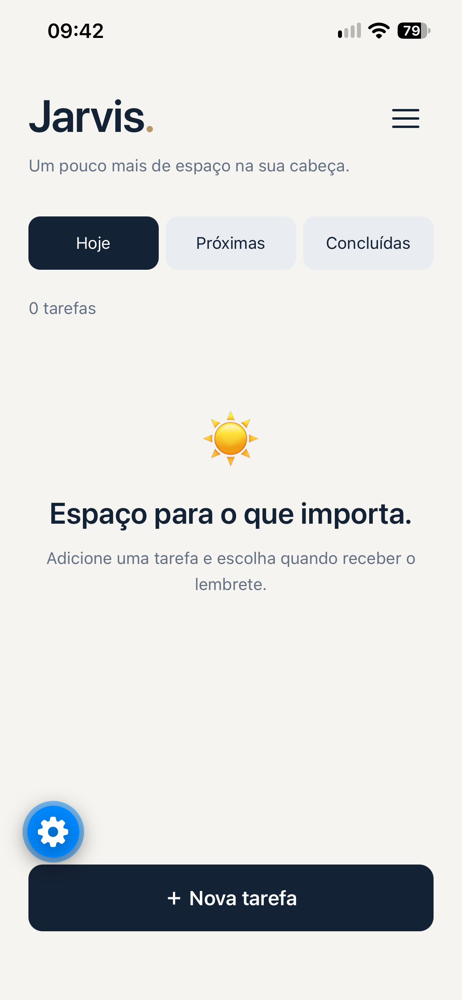
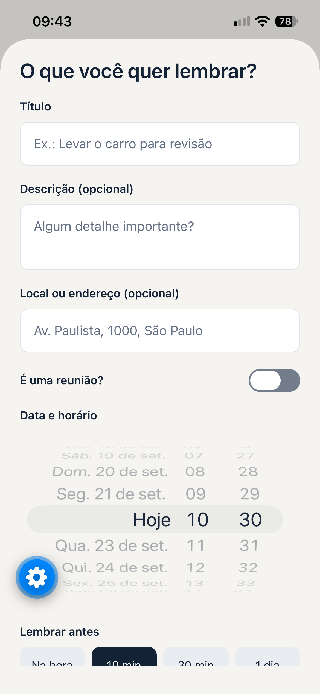

# Jarvis

**Um pouco mais de espaço na sua cabeça.**

Jarvis é um aplicativo de tarefas e lembretes para organizar compromissos pessoais, trabalho e reuniões em um só lugar. Você registra o que precisa fazer, escolhe quando quer ser avisado e acessa o endereço ou o link da reunião direto pela tarefa.

Desenvolvido com **React Native, Expo e TypeScript**, o projeto começou para uso pessoal no iPhone e está evoluindo aos poucos.

> **Status:** primeira versão funcional em desenvolvimento, executada no iPhone pelo Expo Go. Ainda não publicada na App Store. As próximas etapas incluem refinamentos visuais e novas integrações.

## Telas do aplicativo

Tema claro, tema escuro e cadastro de tarefas com endereço, opção de reunião e lembretes.

<table>
  <tr>
    <th>Tema claro</th>
    <th>Tema escuro</th>
    <th>Nova tarefa</th>
  </tr>
  <tr>
    <td></td>
    <td></td>
    <td></td>
  </tr>
</table>

## Como o Jarvis ajuda no dia a dia

| Situação | Como usar o Jarvis |
| --- | --- |
| Reunião online de trabalho | Marque a tarefa como reunião, cole o link e receba um lembrete antes do horário. Toque em **Entrar na reunião** para abrir o serviço. |
| Consulta ou compromisso presencial | Informe data, horário e endereço. Use **Abrir no mapa** para localizar o destino e conferir a rota no aplicativo de mapas. |
| Uma tarefa que não pode ficar para depois | Cadastre a atividade e escolha a antecedência do aviso. Ao terminar, marque como concluída. |
| Planejamento da semana | Consulte **Hoje** para as prioridades do dia e **Próximas** para os compromissos futuros. |
| Guardar uma cópia das tarefas | Exporte um backup manual para o app Arquivos e restaure quando precisar. |

## Funcionalidades

### Tarefas e lembretes

- Criar e editar tarefas com título, descrição, data e horário.
- Organizar a lista em **Hoje**, **Próximas** e **Concluídas**.
- Exibir também tarefas atrasadas na lista **Hoje**.
- Receber avisos **na hora, 10 minutos, 30 minutos ou 1 dia antes**.
- Concluir ou excluir tarefas, cancelando seus avisos pendentes.
- Manter as tarefas salvas localmente ao fechar o aplicativo.

Os lembretes são notificações locais agendadas no aparelho. O iPhone precisa permitir notificações; modo Foco, ajustes de som e limites do sistema podem afetar a apresentação dos avisos.

### Compromissos presenciais

O campo opcional **Local ou endereço** permite guardar o destino junto da tarefa. Quando preenchido, o cartão mostra o botão **Abrir no mapa**.

O Jarvis abre uma busca no **Apple Maps** com o endereço informado. Recomenda-se incluir rua, número e cidade e conferir o resultado antes de iniciar a rota. O Jarvis não precisa acessar sua localização para abrir essa busca.

### Reuniões online

Ative **É uma reunião?** para mostrar o campo opcional de link. Cole o endereço do Google Meet, Microsoft Teams, Zoom ou outro serviço que ofereça um link web válido.

O botão **Entrar na reunião** abre o link no aplicativo ou navegador disponível no iPhone. O Jarvis não cria reuniões nem conecta suas contas nesses serviços. A entrada pode depender de login, instalação do aplicativo ou autorização do organizador.

Reuniões presenciais podem ficar sem link. Ao desmarcar a opção de reunião e salvar, o link é removido da tarefa.

### Aparência e perfil

O menu **☰** reúne:

- **Perfil:** editar nome, escolher uma foto da biblioteca ou removê-la. As informações ficam salvas no aparelho.
- **Aparência:** escolher **Claro**, **Escuro** ou **Sistema**, que acompanha o tema do iPhone.
- **Backup:** exportar e restaurar tarefas.
- **Assine o Pro:** opção reservada para o futuro, atualmente marcada como **Em breve**, sem compra ou assinatura ativa.

O visual combina azul-marinho, branco quente e detalhes dourados. A troca entre temas tem uma transição suave, e a abertura do app apresenta uma animação de aproximadamente dois segundos. Os efeitos respeitam a preferência **Reduzir Movimento** do iPhone.

## Integrações implementadas

| Integração | O que faz |
| --- | --- |
| Notificações do iPhone | Entrega lembretes locais de tarefas. |
| Apple Maps | Abre a busca pelo endereço do compromisso. |
| Links de Meet, Teams, Zoom e outros serviços | Abre o endereço da reunião no aplicativo ou navegador disponível. |
| Biblioteca de fotos | Permite selecionar a imagem do perfil. |
| Arquivos e compartilhamento do iPhone | Permite exportar e selecionar arquivos de backup, inclusive em uma pasta do iCloud Drive disponível no aparelho. |

## Backup manual

Em **☰ → Backup**, escolha:

1. **Exportar backup:** abre o compartilhamento do iPhone. Escolha **Salvar em Arquivos**, selecione a pasta e confirme. Confira se o arquivo foi salvo; cancelar o compartilhamento não cria uma cópia no destino.
2. **Restaurar backup:** selecione um arquivo do Jarvis e confira o resumo antes de confirmar.

O backup inclui **tarefas, endereços, links de reunião, indicação de reunião e preferência de tema**. Nome e foto do perfil ainda não são incluídos.

Na restauração:

- Tarefas ausentes são adicionadas.
- Tarefas com o mesmo identificador são mantidas como estão no aparelho, sem duplicação ou substituição por uma versão antiga.
- Nenhuma tarefa atual é apagada.
- O tema do backup é aplicado.
- Lembretes das tarefas adicionadas são reagendados quando ainda estão no futuro e a tarefa não foi concluída, conforme permissões e capacidade do aparelho.
- Falhas de agendamento são informadas ao final.

Arquivos antigos sem os campos de endereço e reunião continuam compatíveis. Os arquivos são validados antes da importação, com limite de **5 MB e 10.000 tarefas**.

## Dados e funcionamento offline

As tarefas, a preferência de tema e o perfil ficam armazenados no aparelho. Não há conta Jarvis, servidor próprio, backup automático ou sincronização entre dispositivos nesta versão.

Você pode consultar e editar os dados locais sem internet depois que o app estiver carregado. Os serviços externos, como reuniões e buscas no mapa, podem precisar de conexão. Durante o desenvolvimento, o Expo Go usa o servidor do computador para carregar o projeto.

O backup é um arquivo JSON legível. Guarde-o em uma pasta pessoal. Apagar o app ou os dados do Expo Go pode remover as informações locais.

## Executar o projeto

### Requisitos

- Node.js LTS com npm instalado no computador.
- iPhone com Expo Go compatível com o **Expo SDK 57**.
- Conta Expo para entrar no Expo Go e na ferramenta de desenvolvimento.
- Computador e iPhone na mesma rede Wi-Fi para o fluxo de conexão local.

O código do aplicativo está na raiz deste repositório, junto do arquivo `package.json`.

### No Windows

Abra o **CMD ou PowerShell**, entre na raiz do repositório clonado e execute:

```cmd
npm.cmd install
npx.cmd expo login
npm.cmd start
```

Execute os comandos na pasta que contém `package.json`. O login pode ser dispensado se a ferramenta já estiver autenticada.

Entre com a mesma conta no Expo Go do iPhone. Leia o QR code com a câmera e abra o projeto. Autorize as notificações quando solicitado. Mantenha o terminal do servidor aberto durante os testes.

> Execute os comandos no CMD ou PowerShell, não no console interativo do Node.js que mostra apenas `>`.

### Atualizar e encerrar

- Pressione **`r`** no terminal do servidor para recarregar o aplicativo.
- Pressione **Ctrl + C** para encerrar o servidor.
- Se precisar reiniciar limpando o cache:

```cmd
npm.cmd start -- --clear
```

## Tecnologias

- **React Native + Expo:** interface e recursos do iPhone.
- **TypeScript:** organização e verificação do código.
- **AsyncStorage:** persistência local de tarefas e preferências.
- **Expo Notifications:** agendamento de lembretes.
- **React Native Linking:** abertura de mapas e links de reunião.
- **Expo FileSystem, DocumentPicker e Sharing:** arquivos de backup e armazenamento de fotos do perfil.
- **Expo ImagePicker:** escolha da foto do usuário.

## Estrutura do aplicativo

```text
Jarvis/
├── App.tsx                 # Telas, tarefas, temas e abertura animada
├── app.json                # Configuração do Expo
├── src/
│   ├── tasks.ts            # Modelo, filtros, endereços e links
│   ├── reminders.ts        # Agendamento e cancelamento de avisos
│   ├── ProfileMenu.tsx     # Menu, perfil e seleção de tema
│   ├── backup.ts           # Validação e união dos dados de backup
│   ├── backupFiles.ts      # Exportação e seleção de arquivos
│   ├── restoreReminders.ts # Reagendamento após restauração
│   └── backup.test.mjs     # Testes de backup, mapas e links
└── package.json
```

## Verificação

Na pasta do aplicativo:

```cmd
npm.cmd run typecheck
node --experimental-strip-types --test src/backup.test.mjs
```

Os testes cobrem validação de arquivos, restauração sem duplicações, preservação das tarefas atuais, compatibilidade com backups antigos e tratamento de endereços e links. O comando de testes requer uma versão recente do Node com suporte à remoção de tipos TypeScript, como Node 24 LTS.

A interface, abertura de aplicativos externos, escolha de fotos, compartilhamento de arquivos e entrega real de notificações também precisam ser conferidos no iPhone.

## Ideias para próximas versões

- Refinar o visual e a experiência de uso.
- Escolher uma agenda externa para salvar compromissos, como iCloud ou Google sincronizado no iPhone.
- Backup automático em nuvem e contas pessoais.
- Sincronização entre dispositivos.
- Siri e Atalhos.
- Widget com próximas tarefas.
- Definir as funcionalidades de uma futura versão Pro.

Esses itens são ideias de evolução, não recursos disponíveis na versão atual. A integração com calendários, Siri e widgets será avaliada para uma versão própria instalada no iPhone.
